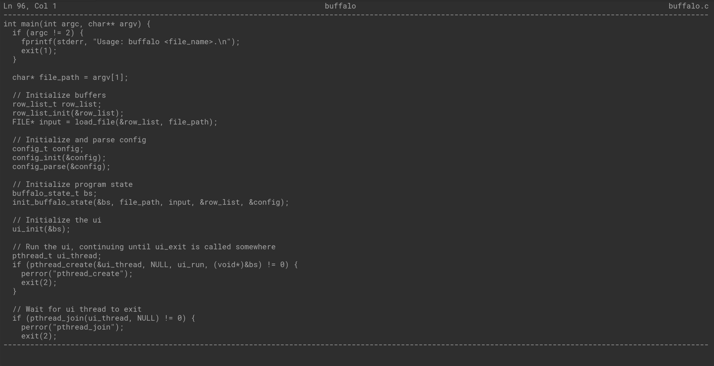

# buffalo: a terminal text editor 🦬

> *Buffalo buffalo Buffalo buffalo buffalo buffalo Buffalo buffalo.*

**buffalo** is a terminal text editor written in C and built on top of ncurses.



## Running

Compile the program with `make`, dependencies are the `curses` and `pthread` libraries. Then run it by passing the name of a file as and argument. The file will be created if it does not already exist:

```sh
$ make
$ ./buffalo hello.txt
```

## Configuration

The editor can be configured with a `.buffalorc` file. The editor first checks for such a file in the current directory, and if not found it looks in the home directory. The configuration file has a simple key/value structure. Here's an example:

```
build: make
test: make test
```

This configures the editor to use `make` as the build command and `make test` as the test command.

## Shortcuts

The following shortcuts are recognized:

```
Ctrl+S: save
Ctrl+Q: quit
Ctrl+B: build
Ctrl+T: test
```

## Bugs

There are some known bugs:

- Horizontal scrolling has not been implemented, so characters past the width of the terminal cannot be viewed, but they can be edited.